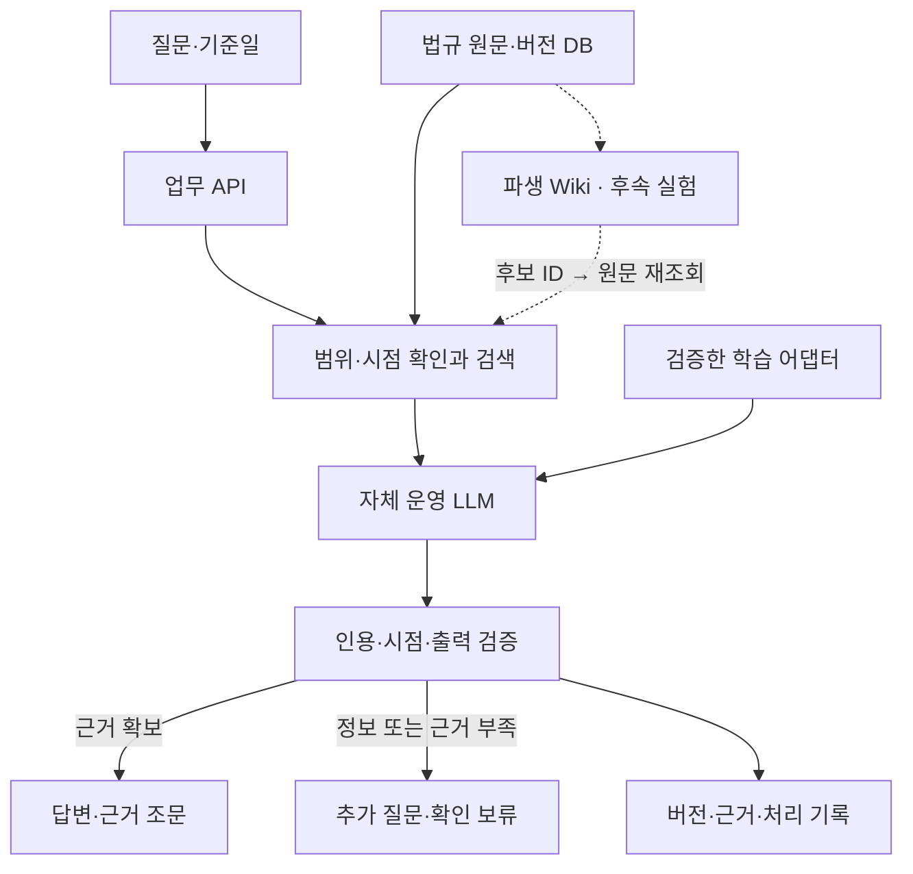

# FinReg — 금융권 법규 확인 LLM

**문서:** Product Requirements Document v1.0  
**작성일:** 2026-09-22  
**상태:** 개발 착수를 위한 제안 초안  
**개발 형태:** 1인 개발 / 한국어 / 대한민국 금융 법규 / 공개 데이터 기반  
**핵심 목표:** 직접 미세조정하고 운영하는 LLM으로 금융 업무 질문에 필요한 법규를 찾고, 적용 기준일과 근거 조문을 함께 확인한다.

> 이 문서의 기능, 일정, 데이터 수량, 성능 수치는 프로젝트의 제안 목표다. 실제 구현 결과나 측정 성과를 뜻하지 않는다. 제품은 법규 확인과 검토를 돕는 도구로 설계하며, 개별 사건의 위법 여부를 최종 판정하지 않는다.

## 1. 제품 개요와 문제 정의

금융 업무에 필요한 규정은 법률, 시행령, 감독규정, 공식 해석 자료 등에 나뉘어 있다. 사용자는 자신의 질문에 필요한 자료를 찾은 다음, 관련 조문과 예외를 확인하고 해당 시점에 적용할 수 있는지 검토해야 한다.

FinReg는 이 확인 과정을 한 화면에서 지원한다. 사용자가 업무 질문과 기준일을 입력하면, 수집 범위 안에서 관련 규정을 검색하고 근거에 연결된 설명을 제공한다. 근거가 부족하거나 적용 조건이 불명확하면 필요한 추가 정보와 확인할 사항을 표시한다.

프로젝트의 모델 개발 범위는 **공개 가중치 모델을 확보해 직접 실행하고, 검수한 금융 법규 질의 데이터로 미세조정하며, 학습 전후 성능을 비교하는 것**이다. 기반 모델을 처음부터 사전학습하는 작업은 별도의 연구 범위로 둔다.

| 달성할 목표 | 확인할 결과물 |
| --- | --- |
| 금융 법규에 근거한 답변 제공 | 핵심 설명마다 연결된 조문과 원문 |
| 적용 시점 확인 | 질문 기준일, 근거 버전, 시행일, 수집 시점 표시 |
| 직접 모델 학습·운영 | 학습 코드, 어댑터, 자체 추론 서버, 실험 기록 |
| 미세조정의 효과 검증 | 기본 모델·RAG·미세조정 모델의 동일 평가셋 비교 |
| 결과 추적 가능성 확보 | 모델·데이터·프롬프트 버전 및 사용 근거 기록 |

## 2. 사용자와 주요 사용 시나리오

### 2.1 목표 사용자

| 사용자 | 필요한 도움 | 초기 제품의 역할 |
| --- | --- | --- |
| 은행 업무 담당자 | 상품 설명이나 고객 응대 시 관련 규정 확인 | 관련 조문과 확인 항목 제시 |
| 금융 IT 개발자 | 업무 요구사항의 규정 근거 확인 | 적용 조건과 개발 시 추가 확인할 사항 정리 |
| 준법·리스크 검토 담당자 | 검토할 법규와 근거를 빠르게 탐색 | 원문 탐색과 검토 자료 작성 보조 |
| 개발자 본인·시연 참여자 | 공개 데이터로 제품 기능 검증 | 가상의 업무 질문을 사용한 데모 |

초기 검증은 공개 법규와 가상 사례로 진행한다. 실제 은행 내부 규정, 고객 정보, 사내망 연동은 별도 도입 과제로 둔다.

### 2.2 대표 시나리오

아래는 제품 입력 예시이며, 법률상 결론을 미리 정한 사례가 아니다.

1. **관련 규정 찾기:** “대출상품을 설명할 때 확인해야 하는 규정과 조문을 찾아줘.”
2. **근거를 읽고 이해하기:** “찾은 조문의 의무와 예외를 구분해서 설명해줘.”
3. **업무 상황 확인:** “고객이 설명을 생략해 달라고 했어. 어떤 조건과 규정을 추가 확인해야 해?”
4. **시점 확인:** “이 거래일에 적용할 수 있는 조문인지 확인해줘.”
5. **정보 보완:** 상품 종류나 거래일이 필요한 질문에서는 먼저 필요한 정보를 묻는다.

성공한 사용자 경험은 ‘답변을 읽음’에서 끝나지 않는다. 사용자가 답변의 근거 조문을 열어 해당 설명을 확인할 수 있어야 한다.

## 3. 초기 범위와 확장 범위

### 3.1 MVP의 도메인

초기 범위는 **은행 대출상품 설명과 관련한 금융소비자보호 법규 확인**으로 제안한다. 다루는 업무는 좁히되, 해당 업무에 필요한 정의·위임 조항·부칙·별표는 함께 수집한다.

| 구분 | 대상 | 적용 원칙 |
| --- | --- | --- |
| 핵심 법률 | 금융소비자 보호에 관한 법률 | 관련 조문뿐 아니라 정의와 참조 관계 포함 |
| 하위 규정 | 해당 법률의 시행령 | 법률에서 위임하거나 참조한 내용 연결 |
| 감독규정 | 금융소비자 보호에 관한 감독규정 | 수집 시 정확한 명칭·버전·적용 범위 확인 |
| 보조 자료 | 공식 기관의 관련 FAQ·해석 자료 | 출처와 문서 성격을 표시하고 법령 원문과 구분 |

특정 조문 번호와 시행일은 공식 원문을 수집한 뒤 확정한다. 앞선 대화의 예시 날짜를 실제 법령 메타데이터로 사용하지 않는다.

### 3.2 기능 우선순위

| 우선순위 | 범위 | 완료 조건 |
| --- | --- | --- |
| P0 · 첫 출시 | 질문·기준일 입력, 법규 검색, 근거 답변, 원문 보기, 추가 질문·보류, 자체 추론, 미세조정 비교 | 12절의 출시 기준 충족 |
| P1 · 확장 | 개정 전후 비교, 정기 갱신, 질문 이력, 관리자 화면, Spring Boot 연동 | P0 평가 통과 후 추진 |
| P2 · 연구 | RAFT 방식 학습, 추가 사전학습, 조문 관계 그래프 고도화 | 구체적인 오류 유형과 개선 가설이 있을 때 추진 |

은행법, 전자금융거래법, 신용정보 관련 법규, 자금세탁방지 관련 법규는 이후 도메인별로 확장한다. 각 확장에는 별도의 데이터 범위와 평가셋을 둔다.

MVP는 모든 금융 법규, 모든 과거 시점, 판례 전체 검색, 실제 고객 대상 금융 의사결정, 규제기관에 대한 자동 신고·제출을 지원 범위로 삼지 않는다. 초기 버전의 지원 범위는 UI에 명확히 표시한다.

## 4. 제품의 핵심 원칙

1. **법규 확인을 위한 설명에는 근거를 연결한다.** 모델이 기억하는 내용만으로 법률상 의무나 예외를 단정하지 않는다.
2. **질문 기준일과 데이터 수집일을 구분한다.** 최근에 수집했다는 사실이 해당 거래일에 적용된다는 의미는 아니다.
3. **정보가 부족하면 부족한 조건을 구체적으로 묻는다.** 검색 실패를 ‘관련 규정이 없음’으로 바꾸어 표현하지 않는다.
4. **출처의 성격을 보존한다.** 법률, 시행령, 감독규정, FAQ, 해석 자료를 같은 효력의 자료로 취급하지 않는다.
5. **미세조정의 효용을 측정한다.** 직접 학습한 모델의 성능이 낮으면 원인을 기록하고 개선한다. 학습 실행 자체를 품질 개선으로 간주하지 않는다.
6. **법규 갱신과 모델 학습을 독립적으로 운영한다.** 원문이 개정되면 검색 데이터와 검증 항목을 갱신하고, 재학습은 필요성과 평가 결과에 따라 수행한다.

## 5. 사용자 흐름과 화면

### 5.1 기본 흐름

사용자가 질문과 기준일을 입력한다. 시스템은 지원하는 법규·기간에 해당하는지 확인하고 관련 조문을 검색한다. 필요한 경우 상품 유형이나 거래 상황을 추가로 묻는다. 확보한 근거로 설명을 생성한 뒤, 인용과 시점의 무결성을 검사해 결과를 표시한다.

| 화면 | 주요 요소 |
| --- | --- |
| 질문 화면 | 질문 입력, 기준일 선택, 지원 법규·기간 안내, 예시 질문 |
| 답변 화면 | 확인된 내용, 적용 조건, 예외·추가 확인 사항, 근거 조문 |
| 근거 패널 | 법규명, 조·항·호, 원문 발췌, 시행일, 공식 원문 링크 |
| 데이터 상태 | 수집 범위, 마지막 수집 성공 시각, 최신성 상태 |
| 검토 필요 상태 | 부족한 사실관계 또는 근거, 다음에 확인할 질문 |

### 5.2 답변 구조

답변은 아래 순서를 기본으로 한다.

- **확인된 내용:** 확보한 근거로 설명할 수 있는 내용.
- **적용 조건:** 설명이 성립하는 상품·거래·당사자 조건.
- **예외와 추가 확인 사항:** 참조 조항, 경과조치, 빠진 사실관계.
- **근거:** 각 핵심 설명과 연결된 조문·원문·버전.
- **기준:** 질문 기준일과 데이터 수집 시점.

‘모델 신뢰도 95%’처럼 보정되지 않은 확률은 표시하지 않는다. 사용자에게는 ‘근거 확인’, ‘추가 정보 필요’, ‘자료 부족’처럼 이해할 수 있는 상태를 제공한다. ‘근거 확인’은 인용 원문과 버전을 대조했다는 의미로 사용하며, 법률 해석의 정확성을 보증하는 표시로 사용하지 않는다.

## 6. 기능 요구사항과 수용 기준

| ID | 요구사항 | 수용 기준 |
| --- | --- | --- |
| FR-01 | 자연어 질문과 기준일 입력 | 기준일이 없으면 한국 시간 기준 오늘을 적용하고 화면에 표시한다. 질문에 별도의 거래일이 있으면 적용할 날짜를 확인한다. |
| FR-02 | 지원 범위 판별 | 미수집 법규·기간에 대한 질문을 지원 가능으로 표시하지 않는다. 범위 밖 질문에는 범위를 설명한다. |
| FR-03 | 관련 조문 검색 | 키워드·의미 검색 결과를 합치고, 기준일·문서 종류로 필터링한다. 조문 번호와 법규명 직접 검색도 지원한다. |
| FR-04 | 조문 문맥 보존 | 조·항·호, 단서, 정의·위임 조항과 필요한 부칙·별표를 함께 확인할 수 있다. 길이 제한으로 제외한 근거가 있으면 기록한다. |
| FR-05 | 근거 기반 설명 | 법률상 의무·허용·예외 등 핵심 주장에 근거 ID를 연결한다. 제공된 근거에 없는 조문이나 URL을 만들어 내지 않는다. |
| FR-06 | 인용 무결성 검사 | 근거 ID 존재, 지정 버전, 원문 발췌 일치, 기준일 적합 여부를 검사한다. 실패한 인용은 최종 근거로 노출하지 않는다. |
| FR-07 | 시점·적용 조건 확인 | 수집·검증된 기간 안에서 답한다. 시행 예정 규정을 현행 규정으로 제시하지 않으며, 경과조치의 적용이 불명확하면 검토 필요로 표시한다. |
| FR-08 | 추가 질문과 답변 보류 | 상품 종류·거래일·당사자 구분 등 필요한 조건을 특정해 질문한다. 검색 실패·근거 충돌 시 확인되지 않은 결론을 확정하지 않는다. |
| FR-09 | 공식 원문 보기 | 답변의 근거를 누르면 저장한 원문과 공식 출처 링크를 확인할 수 있다. 링크는 수집 메타데이터에서 제공한다. |
| FR-10 | 데이터 갱신 | 원문 수집·정규화·검증을 완료한 새 스냅샷만 활성화한다. 갱신 실패 시 기존 스냅샷을 유지하고 상태를 표시한다. |
| FR-11 | 자체 모델 운영 | 확보한 기반 모델과 선택한 어댑터를 자체 추론 환경에서 실행한다. 사용자 질의에 답하기 위해 외부 상용 LLM API를 필수로 호출하지 않는다. |
| FR-12 | 학습·평가 재현 | 모델 리비전, 데이터 분할, 프롬프트, 검색 설정, 학습 설정, 시드, 결과를 기록한다. 기본 모델과 학습 모델을 동일 조건으로 비교한다. |
| FR-13 | 추적 기록 | 요청 ID, 기준일, 데이터·모델 버전, 근거 ID, 처리 상태, 지연 시간을 남긴다. 민감한 원문 질문은 기본 저장하지 않는다. |

인용 무결성 검사는 **존재하는 조문을 정확히 가져왔는지**를 검사한다. 해당 조문이 답변의 주장을 실제로 뒷받침하는지는 별도의 의미 평가가 필요하며, 문자열 대조만으로 검증 완료 처리하지 않는다.

인용 검사에 실패하면 해당 근거에 의존한 주장도 전달을 멈춘다. 확보한 근거로 최대 1회 재생성하고, 계속 실패하면 그 부분을 확인 보류로 전환한다. 인용만 삭제한 채 법률상 결론을 그대로 내보내지 않는다.

## 7. 데이터 수집·구조화·시점 관리

### 7.1 데이터 확보 방식

| 출처 후보 | 수집 대상 | 개발 착수 시 확인할 사항 |
| --- | --- | --- |
| 국가법령정보센터 | 법률·시행령·행정규칙과 관련 연혁 | 대상 원문, 제공 형식, 버전 식별자, 조문별 시행 정보 |
| 법제처 공동활용 서비스 | 공식 API로 제공하는 법령 데이터 | 이용 신청·인증, 대상 API, 필드, 요청 제한, 이용 조건 |
| 금융위원회·금융감독원 공식 자료 | 관련 고시·FAQ·해석 자료 | 발행 주체, 작성일, 적용 범위, 원문과 해석 자료의 구분 |

API 사용 조건을 확인하고 이용할 수 있으면 API 수집을 우선한다. API 확보가 지연되면 공식 사이트에서 확보한 원문 파일을 수동 등록해 시작한다. 등록 시에도 원문 URL·취득 시각·버전·내용 해시를 함께 기록한다.

문서 작성 시 공식 법규 사이트 접근에 오류가 있어 **현재 조문 내용·최신 버전·개별 API의 가용성을 확인한 것으로 간주하지 않는다.** 이 문서는 데이터 설계를 제안하며, 실제 수집본의 확인을 개발 첫 단계의 완료 조건으로 둔다.

### 7.2 데이터 처리 규칙

1. 원문 파일 또는 응답을 변경하지 않고 보관하고 내용 해시를 계산한다.
2. 검색용 본문은 원문과 분리해 정규화한다. 정규화 과정에서 단서·예외·부정 표현을 제거하지 않는다.
3. 조·항·호를 기본 단위로 구조화하고, 상위 조문과의 관계를 보존한다. 긴 조문을 나눌 때 원문 위치와 부모 ID를 남긴다.
4. 정의·위임·인용 관계를 기록한다. 외부 참조 조문을 수집하지 못했으면 ‘참조 자료 미확보’로 남긴다.
5. 부칙·별표·표 안의 단위나 조건이 추출되지 않으면 해당 내용에 의존하는 질문은 보류한다.
6. 동일 법규의 개정본을 덮어쓰지 않는다. 각 버전과 그 버전으로 만든 검색 인덱스를 연결한다.

### 7.3 최소 데이터 모델

| 엔터티 | 주요 필드 | 목적 |
| --- | --- | --- |
| `source_document` | `source_id`, `official_id`, `title`, `document_type`, `authority`, `source_url` | 출처와 문서 성격 구분 |
| `document_version` | `version_id`, `source_id`, `promulgated_at`, `effective_from`, `collected_at`, `content_hash`, `raw_path` | 공포·시행·수집 시점을 별도로 기록 |
| `provision` | `provision_id`, `version_id`, `article`, `paragraph`, `item`, `text`, `source_offsets`, `parent_id` | 조문 계층과 원문 위치 보존 |
| `applicability` | `provision_id`, `valid_from`, `valid_to_exclusive`, `transition_refs`, `temporal_review_status` | 조문별 적용 기간과 경과조치 확인 상태 |
| `provision_relation` | `from_id`, `to_id`, `relation_type`, `verified` | 정의·위임·참조 관계 추적 |
| `corpus_snapshot` | `snapshot_id`, `version_ids`, `coverage`, `last_success_at`, `activated_at` | 답변 시 사용한 데이터와 범위 재현 |
| `model_release` | `release_id`, `base_revision`, `adapter_id`, `training_dataset_id`, `eval_report_id` | 모델 학습 결과와 배포 버전 연결 |
| `query_trace` | `request_id`, `as_of_date`, `snapshot_id`, `release_id`, `evidence_ids`, `status`, `latency_ms` | 답변 생성 과정 추적 |

`valid_to_exclusive`는 검증된 적용 종료일의 다음 경계를 표현한다. 값이 없다는 이유만으로 무기한 유효하다고 판정하지 않는다. `temporal_review_status`와 수집 범위를 함께 확인한다.

### 7.4 시점 처리의 상세 원칙

- 법령 전체의 시행일을 모든 조문에 기계적으로 복사하지 않는다. 조문별 시행일과 부칙의 별도 적용 조건을 확인한다.
- 공포일, 시행일, 거래일, 수집일을 별도 의미로 다룬다.
- 날짜 필터는 후보를 찾는 단계다. 경과조치와 특례가 있으면 날짜만으로 적용을 확정하지 않는다.
- 초기에는 확인한 현행 스냅샷과 제한된 과거·시행 예정 사례만 지원한다. 검증한 시점과 사례 범위를 데이터 상태에 표시한다.
- 출처 간 설명이 달라 보이면 충돌 지점과 출처를 제시한다. 문서 종류의 순위만으로 법률 해석을 자동 확정하지 않는다.
- P0 갱신은 관리자가 직접 실행한다. 최근 갱신이 설정한 신선도 기준을 넘으면 ‘수집본 기준’ 상태를 표시한다. 초기 기준은 48시간으로 제안하며 법정 의무가 아닌 제품 설정이다.
- P1에서 일일 변경 확인을 자동화한다. 변경 발견 시 검증이 끝난 스냅샷만 교체하고, 캐시에는 스냅샷 ID를 포함한다.

### 7.5 LLM Wiki의 보조 지식 계층

2026-09-23 추가: 출처를 연결한 Markdown Wiki로 개발 개념·결정·미해결 사항을 축적한다. 프로젝트 지식 탐색·출처 변경·파일 링크 검사와 [오프라인 검색 실험](wiki_retrieval.md)을 구현했다. 실험은 BM25 원문 검색과 Wiki 후보 확장의 처리 경로를 가상 규정으로 검증한 단계이며, 실제 RAG 비교와 서비스 연결은 미완료다. 운영 규칙과 도입 근거는 [LLM Wiki 설계](llm_wiki.md)에 기록한다.

법규 검색에 적용할 때는 원문 DB → 버전별 파생 Wiki → 근거 후보 ID → 원문 재조회 순서를 따른다. Wiki 요약을 최종 인용 원문으로 사용하지 않는다. 페이지에는 스냅샷·문서 버전·조문 ID·출처 해시·문서 종류·검수 상태를 연결하고, 원문 변경·참조 누락·시점 미검수 시 검색 보조에서 제외한다. 제외되어도 원문 검색과 기존 보류 규칙을 유지한다. 이는 후속 구현 요구사항이며 현재 법규 Wiki가 구축되었다는 의미가 아니다.

평가 질문·정답·해설과 사용자 질문 원문은 Wiki 입력에서 제외한다. 문서와 Wiki 안의 명령을 실행 지침으로 취급하지 않는다. FR-03~07·10·12·13의 원문 보존·시점·재현 조건은 그대로 적용한다.

## 8. 모델 구축과 학습 전략

### 8.1 구축 방식

초기에는 한국어 질문과 긴 조문을 처리할 수 있는 공개 가중치 모델 후보를 비교한다. **3B~8B 규모를 출발 후보 범위**로 두되, 모델은 GPU·메모리·예산을 확인한 뒤 정한다. 파라미터 수만으로 학습 가능 여부나 한국어 법규 성능을 판단하지 않는다.

| 선택 기준 | 확인 방법 |
| --- | --- |
| 한국어 법규 문장 이해 | 개발용 질문과 근거 문서로 비교 |
| 실행·미세조정 가능성 | 실제 장비에서 입력 길이·배치 크기를 고정해 실험 |
| 배포·수정 허용 범위 | 해당 모델 카드와 라이선스 확인 |
| 근거 활용과 보류 행동 | 근거 있음·없음·상충·정보 부족 사례 평가 |
| 재현성 | 모델·토크나이저 리비전을 고정해 기록 |

### 8.2 단계별 개발

| 단계 | 수행 내용 | 다음 단계로 넘어가는 조건 |
| --- | --- | --- |
| A · 자체 추론 | 기반 모델을 직접 불러와 질문 처리 | 한국어 응답과 실행 자원 확인 |
| B · 검색 기준선 | 같은 모델에 시점·문서 유형을 반영한 RAG 연결 | 검색 실패와 답변 실패를 구분한 평가 결과 확보 |
| C · 직접 미세조정 | 근거 포함 질의·응답 데이터로 SFT 수행, LoRA 또는 QLoRA 활용 | 어댑터 저장·재로딩과 기준선 비교 완료 |
| D · 통합 검증 | 학습 모델 + 동일 검색 + 검증기 평가 | 사전 정의한 출시 기준과 회귀 평가 통과 |

**SFT는 학습 목적·데이터 구성이고, LoRA·QLoRA는 이를 효율적으로 수행하는 방법이다.** 세 가지를 각각 독립된 연속 학습 단계로 취급하지 않는다. QLoRA를 적용하면 양자화한 기반 모델에 추가한 어댑터 파라미터를 학습한다. [T1][T2]

학습 목표는 금융 법규 질문을 이해하고, 제공된 근거를 사용해 적용 조건과 예외를 설명하며, 근거가 부족할 때 적절히 보류하는 행동이다. 법규의 최신성을 모델 가중치만으로 관리하지 않는다.

### 8.3 조건부 연구 범위

- **RAFT 방식의 데이터 구성:** 관련 조문과 혼동하기 쉬운 무관 문서를 함께 넣어 필요한 근거를 선택하도록 학습하는 실험이다. 일반 SFT의 데이터 구성을 확장하는 방식으로 다룬다. 모든 학습 뒤에 별도 RAFT 단계를 반드시 수행하지 않는다. [T3]
- **추가 사전학습(CPT):** 충분한 말뭉치와 자원이 있고, 검색된 법률 문체·용어 자체를 모델이 이해하지 못한다는 근거가 있을 때 검토한다. 수행한다면 별도 실험 분기에서 일반적으로 CPT 후 SFT를 적용하고 일반 언어 성능 저하도 확인한다.
- **관계 그래프:** 기본 참조 관계는 데이터에 보존한다. 별도 GraphRAG 엔진은 여러 조문을 함께 찾아야 하는 질문에서 검색 개선이 필요한지 확인한 뒤 도입한다.

위 세 가지는 초기 완료 요건이 아니다. 미세조정으로 성능이 개선되지 않아도 학습 결과·실패 원인·비교 지표를 남기며, 품질 기준을 통과한 모델만 사용자 응답에 사용한다.

## 9. 학습·평가 데이터 설계

### 9.1 데이터 규모와 검수

최초 20문항으로 질문 유형과 정답 형식을 정한다. 이후 **학습 300~500건, 개발 평가 50건, 최종 평가 100건**을 초기 목표로 삼는다. 이는 소규모 실험을 위한 계획이며 모델 성능에 충분한 데이터량이라는 의미는 아니다.

학습 자료는 ‘질문 + 기준일·사실관계 + 근거 문서 + 답변 + 근거 ID + 답변 상태’로 구성한다. 자동 생성 문항은 초안으로만 사용하고, 원문과 대조한 항목만 학습에 포함한다. 공식 해석을 직접 확인하지 못한 복잡한 사례는 정답을 확정하지 않고 검토 필요 사례로 다룬다.

검수 상태는 `draft`, `reviewed`, `needs_review`, `excluded`로 기록한다. 개발자가 검수한 라벨을 전문가가 인증한 정답으로 표현하지 않는다. 외부 검토가 이뤄지면 검토 범위와 담당을 별도로 기록한다.

### 9.2 데이터 분리

- 질문을 조금 바꾼 패러프레이즈와 동일 사례는 같은 분할에 둔다.
- 관련 쟁점·조문 묶음·사례 템플릿을 기준으로 분할하고, 중복·유사 문항을 확인한다.
- 최종 평가 문항은 학습 데이터 생성, 프롬프트 개선, 검색 파라미터 조정에 사용하지 않는다.
- 법규 원문은 검색 말뭉치에 포함될 수 있다. 평가 질문의 정답 문장·해설 자체는 검색 인덱스에 넣지 않는다.
- 최종 평가를 보고 개선했다면 해당 세트는 개발 평가로 편입하고 새 평가 세트를 마련한다.

### 9.3 최종 평가 100문항의 제안 구성

| 유형 | 문항 수 | 평가 내용 |
| --- | ---: | --- |
| 단일 조문 확인 | 30 | 관련 조문 검색, 원문과 일치하는 설명 |
| 여러 조문·예외 연결 | 25 | 정의·위임·예외 누락 여부 |
| 시점·개정 적용 | 15 | 확인된 버전 선택, 시행 예정·경과조치 처리 |
| 사실관계 부족 | 15 | 필요한 추가 질문 또는 보류 |
| 범위 밖·근거 없음 | 15 | 근거를 지어내지 않고 한계 표시 |
| 합계 | 100 | 유형별 점수와 전체 점수를 함께 보고 |

법규 확인형 평가에서 실제 자료를 확보하지 못한 항목은 준비 미완료로 기록한다. 임의의 시행일을 실제 법규 정답으로 넣지 않는다. 가상 규정으로 만든 시점 처리 테스트는 실제 법규 평가와 구분해 결과를 보고한다.

### 9.4 비교 실험

| 실험 | 모델 | 검색 | 목적 |
| --- | --- | --- | --- |
| E1 | 기본 모델 | 없음 | 모델 자체 지식과 근거 없는 응답 성향 진단 |
| E2 | 기본 모델 | 있음 | RAG 기준선 확보 |
| E3 | SFT 모델 | 없음 | 미세조정으로 바뀐 응답 행동 진단 |
| E4 | SFT 모델 | 있음 | 검색 조건을 고정한 미세조정 효과 확인 |

E2와 E4는 동일한 검색 결과·입력 문맥·생성 한도·검증 규칙으로 비교한다. 기반 모델 리비전과 추론 양자화 설정도 맞춘다. E1·E3는 오프라인 진단용이며, 근거 확인 기능을 갖춘 최종 서비스 구성으로 간주하지 않는다.

검색은 개발 평가셋에서 키워드 검색, 의미 검색, 결합 검색을 비교한 뒤 설정을 고정한다. 모델 원출력의 오류율과 검증 후 사용자에게 전달된 출력의 오류율을 별도로 보고한다. 보류가 늘어서 정확도가 높아진 것인지 확인할 수 있도록 답변 제공률도 함께 측정한다.

Wiki 검색 보조는 E2/E4의 미세조정 비교와 분리해 `RAG` 대 `RAG + Wiki 후보 확장`으로 개발 평가한다. 동일한 모델·원문 스냅샷·문맥 예산·검증기를 고정하고 Recall@5, 다중 조문·예외 누락, 인용·시점 오류, 불필요한 보류, 지연·입력 토큰, Wiki 구축·갱신 비용을 비교한다. 성능 향상을 미리 가정하지 않으며 [채택 기준](llm_wiki.md)을 통과하기 전 서비스 기본 검색을 바꾸지 않는다. 최종 평가 질문·정답·해설은 Wiki 구축과 튜닝에도 사용하지 않는다.

## 10. 시스템 구성과 기술 선택

### 10.1 구성도

여기서 ‘근거 확보’는 인용과 데이터 상태에 대한 시스템 검사 결과다. 답변의 의미적 정확성은 평가셋 검수와 별도로 측정한다.

점선의 법규 Wiki는 서비스에 연결하지 않은 선택 경로다. 오프라인 후보 검색 코드는 별도 실험용이며 현재 저장소의 `wiki/` 개발 지식을 사용자 질의 검색에 투입하지 않는다.

### 10.2 기술 구성

| 영역 | 초기 선택 | 선택 이유·도입 시점 |
| --- | --- | --- |
| 데이터 처리·학습·평가 | Python | 모델 학습과 데이터 작업을 한 언어로 구성 |
| 모델 학습 | PyTorch, Transformers, PEFT, TRL | 모델 로딩·SFT·어댑터 학습 구성 [T1][T2] |
| 추론 | Transformers 기반 자체 프로세스 | 첫 버전의 모델·어댑터 로딩과 디버깅 |
| API | FastAPI | 검색·추론·검증을 연결하는 초기 API |
| 정형 데이터 | PostgreSQL | 법규·버전·근거·실험 메타데이터 관리 |
| 검색 | BM25 계열 검색 + 임베딩 검색, pgvector 후보 | 한국어 토큰화·법규명·조문 번호 검색을 개발 평가로 검증 |
| 재정렬 | 선택적 reranker | 검색 성능 이득이 지연 비용보다 큰지 확인 후 적용 |
| 시연 UI | Gradio 등 간단한 Python UI | 질문·근거 확인을 빠르게 검증 |
| 서비스 확장 | Java / Spring Boot, TypeScript UI | 회원·권한·질의 이력 등을 확장할 때 도입 |
| 배포 | 로컬 또는 단일 GPU 서버 | 장비·예산 확인 후 실행 환경 고정 |

MVP는 Python 중심으로 완성한다. Spring Boot 연동 시에는 Spring이 사용자 인증·서비스 기능을 담당하고 Python 서버가 검색·모델 추론·평가 기능을 제공한다. 별도 고성능 추론 엔진은 장비와 모델 호환성, 처리량 요구를 확인한 뒤 선택한다.

### 10.3 API 초안

| 메서드·경로 | 역할 |
| --- | --- |
| `POST /v1/queries` | 질문·기준일·추가 사실관계 입력, 답변 또는 추가 질문 반환 |
| `GET /v1/provisions/{provision_id}` | 지정 버전의 근거 원문과 메타데이터 조회 |
| `GET /v1/corpus/status` | 지원 법규·기간·갱신 상태 조회 |
| `POST /v1/admin/ingestions` | 관리자용 수집·검증 작업 시작 |
| `GET /v1/admin/evaluations/{run_id}` | 모델·데이터 버전별 평가 결과 조회 |

`POST /v1/queries`의 핵심 응답 필드는 다음과 같다. 실제 법률 결론이나 임의의 시행일을 예시값으로 제공하지 않고 필드 계약만 정의한다.

| 필드 | 의미 |
| --- | --- |
| `request_id` | 요청 추적 ID |
| `status` | `answered`, `needs_clarification`, `insufficient_evidence`, `out_of_scope`, `system_error` |
| `as_of_date` | 사용자가 확인하려는 기준일 |
| `answer` | 근거에 연결된 설명. 보류 상태에서는 확정 결론을 담지 않음 |
| `claims[]` | 핵심 주장과 이를 뒷받침하는 근거 ID 목록 |
| `citations[]` | 조문·버전 ID, 법규명, 조·항·호, 원문 발췌, 시행 정보, 공식 URL |
| `conditions[]` | 적용 조건과 확인한 사실관계 |
| `follow_up_questions[]` | 답변에 필요한 추가 정보 |
| `limitations[]` | 미확보 자료·해석상 확인 필요 사항 |
| `corpus_snapshot_id` / `model_release_id` | 사용한 데이터와 모델 버전 |
| `freshness_status` | 수집 상태에 따른 최신성 표시 |

## 11. 비기능 요구사항

| ID | 항목 | 요구사항 |
| --- | --- | --- |
| NFR-01 | 재현성 | 모델·어댑터·토크나이저·데이터·인덱스·프롬프트·실행 설정을 기록한다. 같은 설정의 재실행이 가능해야 한다. |
| NFR-02 | 응답 시간 | 초기 UX 목표는 단일 동시 요청에서 최종 답변 p95 30초 이내다. 장비가 미정이므로 1주차 측정 후 확정한다. |
| NFR-03 | 지연 측정 | 검색·추론·검증 시간을 구분하고 입력·출력 토큰 수, 장비, 양자화 설정을 함께 보고한다. |
| NFR-04 | 장애 처리 | 검색 실패·모델 오류·시간 초과를 법률상 답변 보류와 구분한다. 원문 탐색이 가능하면 해당 기능을 제공한다. |
| NFR-05 | 접근 제어 | 관리자 수집·모델 교체 API는 인증을 요구한다. 외부 사용자에게 공개할 때 요청 제한과 접근 범위를 설정한다. |
| NFR-06 | 개인정보 | 공개 자료·가상 사례로 시작한다. 사용자 질문 원문 저장은 기본 비활성화하며, 평가용 수집은 마스킹·선별 후 별도 관리한다. |
| NFR-07 | 기록 보관 | 초기 요청 추적 기록은 7일 보관을 제안한다. 실제 보관 기간은 운영 목적·데이터 성격 검토 후 정하며 법정 의무로 표현하지 않는다. |
| NFR-08 | 입력·문서 신뢰 | 검색 문서는 참고 데이터로 취급한다. 문서 안의 명령문이나 사용자 요구가 근거 검사·권한 통제를 변경할 수 없도록 구성한다. |
| NFR-09 | 비용 추적 | 학습·추론의 GPU 시간과 저장량을 기록한다. 모델 선택 전 작은 학습 실험으로 예상 자원을 측정한다. |
| NFR-10 | 복구 | 직전 모델 릴리스와 말뭉치 스냅샷으로 되돌릴 수 있다. 갱신 실패가 정상 데이터를 덮어쓰지 않아야 한다. |

학습 비용과 필요한 GPU 메모리는 모델, 문맥 길이, 배치 크기, 양자화 및 구현에 따라 달라진다. 장비 확인 전에 특정 비용이나 메모리로 가능하다고 확정하지 않는다.

## 12. 평가 지표와 출시 기준

아래 수치는 초기 내부 데모의 **잠정 목표**다. 실제 금융기관 도입 적합성을 인증하는 기준이 아니다. 기준선 결과를 본 뒤 목표를 변경하면 이유와 변경 시점을 남기고, 최종 평가 전에 고정한다.

| 지표 | 측정 방법 | 잠정 목표 |
| --- | --- | --- |
| 근거 검색 Recall@5 | 답변 가능 질문별로 정답 근거 중 상위 5개 검색 결과에 포함된 비율을 계산해 평균 | 90% 이상 |
| 답변 정합성 | 답변 가능한 최종 평가 문항 중 핵심 결론·조건·예외가 검수 기준을 만족한 문항 비율. 부당한 보류도 실패로 계산 | 85% 이상 |
| 주장별 근거 일치율 | 법률상 의무·예외 등 실질적인 주장 중 인용 근거가 실제로 뒷받침하는 주장 비율 | 95% 이상 |
| 허위·불일치 인용 | 최종 전달 답변에서 없는 조문·틀린 버전·원문 불일치 발췌의 개수 | 평가셋에서 0건 |
| 시점 오류 | 검증한 시점 문항에서 다른 버전을 사용하거나 적용 조건을 잘못 확정한 문항 수 | 평가셋에서 0건 |
| 적절한 추가 질문·보류 | 사실관계 부족·범위 밖·근거 없음 문항에서 적절한 상태를 선택한 비율 | 90% 이상 |
| 불필요한 보류 | 답변 가능한 문항에서 근거가 충분한데도 답하지 않은 비율 | 15% 이하 |
| 사용자 과업 성공 | 예시 질문 입력 후 관련 근거를 열어 확인하는 과업 | 5개 시연 과업 중 4개 이상 성공 |

추가 해석이 필요한 질문에는 정답·보류 기대 상태를 검수 과정에서 먼저 정의한다. 원문 존재 검사는 자동화하되, 정합성과 의미적 근거 일치는 검수 기준에 따라 사람이 확인한다. 다른 LLM의 채점은 검수 보조로만 사용한다.

E4의 미세조정 모델을 채택하려면 위 품질 기준을 만족하고 E2 대비 정합성·인용·시점 지표가 악화되지 않아야 한다. 소규모 평가의 점수 차이는 개선 경향으로 보고하며, 근거 없이 통계적으로 유의한 개선이라고 표현하지 않는다.

평가셋에서 오류가 없었다는 결과를 전체 서비스의 무오류 보장으로 확대하지 않는다. 전체 비율뿐 아니라 유형별 표본 수와 실패 사례를 함께 기록한다.

### 주요 실패 시나리오의 기대 동작

| 상황 | 기대 동작 |
| --- | --- |
| 관련 자료가 검색되지 않음 | ‘규정이 없다’고 답하지 않고 수집·검색 한계 표시 |
| 시행 예정 조문이 함께 검색됨 | 질문 기준일과 맞는지 구분하고 현행으로 혼용하지 않음 |
| 필요한 부칙·별표를 확보하지 못함 | 확인 가능한 범위만 설명하고 적용 결론 보류 |
| 두 자료의 설명이 상충함 | 차이를 표시하고 확인할 출처·조건 제시 |
| 존재하는 조문을 엉뚱한 주장에 인용함 | 의미적 근거 평가에서 실패로 처리하고 오류셋에 추가 |
| 모델이 공식 URL을 새로 생성함 | 저장한 출처 URL과 일치하지 않으면 근거 링크로 사용하지 않음 |
| 모델 또는 검색 서버 장애 | `system_error` 반환, 법률상 판단 불가와 구분 |
| 데이터 수집이 오래됨 | 수집본 기준임을 표시하고 최신 규정으로 단정하지 않음 |

## 13. 개발 일정과 단계별 결과물

**계획 가정:** 1인 개발, 주 15~20시간, 초기 8주. 데이터 접근, 법규 검수, 학습 장비 확보가 일정에 가장 큰 영향을 준다. 일정이 부족하면 화면·도메인 확장부터 줄이고 데이터 검수와 평가를 유지한다.

| 주차 | 주요 작업 | 결과물·완료 기준 |
| --- | --- | --- |
| 1주차 | 범위 확정, 공식 원문 확보 방식 확인, 장비 점검, 모델 후보 실행, 예시 질문 20개 작성 | 대상 자료 목록, 모델 실행 기록, 질문·정답 형식 |
| 2주차 | 법규 구조화, 버전·참조 관계 저장, 평가 기준 정의, 개발·최종 평가 문항 분리 | 말뭉치 v1, 개발 평가 50건·최종 평가 100건의 검수 계획과 분할 |
| 3주차 | 키워드·의미 검색 비교, 기본 모델 RAG, 근거 표시 | E1·E2 기준선 보고서, 검색 실패 사례 |
| 4주차 | 시점 검사, 보류·추가 질문, 단순 UI, 최종 평가셋 검수 완료·봉인 | 기능 데모 v0.1, 고정 평가셋 |
| 5주차 | 학습 문항 300~500건 작성·검수, 소규모 SFT 실험 | 학습셋 v1, 어댑터 v1, 학습 자원 기록 |
| 6주차 | 개발 평가셋으로 오류 분석·개선, E3·E4 개발 평가 | 설정이 고정된 최종 모델 후보 |
| 7주차 | 최종 평가 1회, 장애·갱신·버전 추적 확인 | 네 실험 비교표, 실패 사례, 채택·보류 결정 |
| 8주차 | 출시 기준 확인, 문서·데모 정리, 필요 시 제한된 재검증 | MVP v1.0, 실행 안내, 모델·데이터 카드, 평가 보고서 |

모델 개선이 출시 기준에 못 미치면 ‘실험 완료’와 ‘서비스 출시’를 구분한다. 원인에 맞게 데이터·검색·모델을 개선하고, 최종 평가셋을 개발에 사용했다면 새로운 평가셋을 준비한다.

## 14. 완료 정의와 산출물

- 수집 범위·원문·버전·시행 정보를 추적할 수 있는 법규 말뭉치가 있다.
- 자체 추론 환경에서 기반 모델과 학습 어댑터를 불러올 수 있다.
- 질문·기준일 입력부터 답변·근거 확인 또는 적절한 보류까지 동작한다.
- 학습·개발·최종 평가 데이터가 분리되어 있고 검수 상태가 기록되어 있다.
- E1~E4를 비교한 평가 보고서와 구체적인 실패 사례가 있다.
- 지원 범위 밖, 시점 불명확, 자료 충돌, 서버 장애가 구분되어 처리된다.
- 사용 모델과 데이터 출처, 실행 설정, 장비, 학습·추론 비용 기록이 있다.
- 실행 안내, 데이터 카드, 모델 카드, API 명세, 짧은 시연 자료가 있다.

모델 카드에는 기반 모델과 라이선스, 학습한 업무 범위, 학습 데이터의 성격, 평가 방법, 실패 유형을 적는다. ‘금융법규를 이해한다’ 같은 포괄적 표현만으로 성능을 설명하지 않는다.

## 15. 주요 리스크와 결정 항목

| 항목 | 영향 | 대응·결정 방법 |
| --- | --- | --- |
| GPU·예산 미정 | 모델 크기와 학습 일정 변동 | 1주차에 장비 확인, 작은 학습 실험으로 자원 측정 |
| 공식 원문·API 접근 지연 | 수집 자동화 지연 | 출처를 기록한 수동 등록으로 시작, API 연결은 검증 후 적용 |
| 법규 해석 라벨의 신뢰도 | 틀린 정답을 학습·평가에 사용 | 원문 대조, 불확실 사례 분리, 가능하면 관련 지식 보유자의 별도 검수 |
| 복잡한 부칙·경과조치 | 잘못된 적용 시점 안내 | 검증 범위를 제한하고 사례별 추가 사실관계 확인 |
| 미세조정의 성능 저하 | 근거 활용·보류 행동 악화 | E2·E4 동일 조건 비교, 이전 모델로 복구 |
| 답변 보류 편향 | 정확도만 높고 쓸모없는 제품 | 답변 가능 문항의 정합성과 불필요한 보류율 함께 측정 |
| 일정 초과 | 검증 없는 학습·시연으로 끝남 | 추가 도메인·별도 웹 UI·고급 학습을 후순위로 조정 |

개발 착수 시 확정할 사항은 세 가지다. **사용 가능한 GPU·메모리와 월 예산, 초기 업무 범위, 법규 정답을 검수할 방법**이다. 확정 전에도 원문 목록 작성과 예시 질문 20개 설계는 진행할 수 있다.

## 16. 첫 작업 목록

1. 초기 업무를 ‘대출상품 설명 관련 법규 확인’으로 가정하고 예시 질문 20개를 작성한다.
2. 질문별로 필요한 법률·시행령·감독규정의 공식 원문을 확보하고 출처·버전·수집 시점을 기록한다.
3. 질문·기준일·근거·기대 답변 상태를 검수해 데이터 형식을 고정한다.
4. 장비에 맞는 공개 가중치 모델 후보를 직접 실행하고 한국어 질문을 처리한다.
5. 첫 20문항에 대해 ‘기본 모델’과 ‘근거를 넣은 모델’의 결과를 기록한다.
6. 확인된 오류를 기준으로 검색·미세조정에 필요한 학습 사례를 만든다.

## 17. 출처와 확인 상태

### 법규 데이터 출처 후보

- [국가법령정보센터](https://www.law.go.kr/): 법령 원문 확보 출처. 문서 작성 시 최신 개별 법령과 버전 확인은 완료하지 못했으며 수집 단계에서 확인한다.
- [법제처 국가법령정보 공동활용](https://open.law.go.kr/): API 후보. 이용 조건·제공 항목·응답 형식은 개발 시 공식 가이드로 확인한다.
- [금융위원회](https://www.fsc.go.kr/): 소관 법규·공식 설명 자료의 출처 후보.
- [금융감독원](https://www.fss.or.kr/): 공식 업무 설명·관련 자료의 출처 후보.

### 모델 구축 참고 자료

- **[T1]** [Hugging Face PEFT — Quantization](https://huggingface.co/docs/peft/developer_guides/quantization): 2026-09-22 열람. 양자화 모델에 어댑터를 추가하는 방법과 QLoRA 방식의 학습을 설명한다.
- **[T2]** [Hugging Face TRL — SFT Trainer](https://huggingface.co/docs/trl/sft_trainer): 2026-09-22 열람. 질의·응답 데이터 기반 SFT와 PEFT 어댑터 학습 연동을 설명한다.
- **[T3]** [RAFT: Adapting Language Model to Domain Specific RAG](https://arxiv.org/abs/2403.10131): 2026-09-22 열람. 관련·무관 문서를 함께 사용하는 검색 기반 미세조정 연구다. 한국 금융 법규에서의 효과는 이 프로젝트의 실험으로 확인해야 한다.

본 PRD의 성능 목표·일정·설계 선택은 작성자의 제안이며 위 자료가 금융권 도입 적합성이나 목표 수치를 보증한다는 의미가 아니다.
